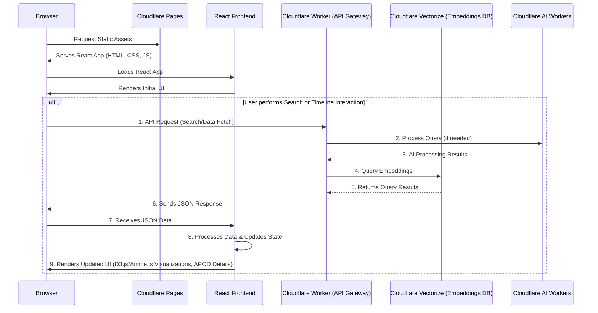

# APOD Imagery :telescope:

> A comprehensive pipeline for processing NASA's Astronomy Picture of the Day (APOD) data with semantic search, intelligent image analysis, and interactive visualizations.

## Overview

This project creates an intelligent exploration platform for NASA's APOD archive, combining multiple AI models to generate semantic embeddings, analyze imagery, and deliver content through a performant web application. The system processes astronomical images and descriptions to enable semantic search, content classification, and visual discovery of space imagery.

## :sparkles: Key Features

- **Semantic Search**: Vector-based search across APOD descriptions and generated image captions
- **AI-Powered Image Analysis**: Automated description generation and object detection for astronomical images
- **Interactive Timeline**: Visual exploration of APOD data with D3.js-powered visualizations
- **Real-time Processing**: Live AI inference using Cloudflare's edge computing platform
- **Model Evaluation Framework**: Comprehensive testing and validation of AI model performance
- **Responsive Design**: Optimized experience across desktop and mobile devices

## :building_blocks: Architecture

### System Overview

The application follows a modern serverless architecture leveraging Cloudflare's edge platform:

- **Frontend**: React SPA hosted on Cloudflare Pages
- **API Layer**: Cloudflare Workers for serverless compute
- **Vector Database**: Cloudflare Vectorize for semantic search
- **AI Models**: Cloudflare AI Workers for image and text processing
- **Storage**: Cloudflare R2 for image assets

### Data Flow



## :robot: AI Models & Processing Pipeline

The system leverages multiple specialized AI models from Cloudflare's catalog:

| Model | Purpose | Use Case |
|-------|---------|----------|
| `@cf/llava-hf/llava-1.5-7b-hf` | **Vision-Language** | Generate descriptive captions from astronomical images |
| `@cf/baai/bge-base-en-v1.5` | **Text Embedding** | Create semantic vectors for search and similarity matching |
| `@cf/huggingface/distilbert-sst-2-int8` | **Text Classification** | Categorize APOD content by astronomical phenomena |
| `@cf/facebook/detr-resnet-50` | **Object Detection** | Identify celestial objects and structures in images |
| `@cf/microsoft/resnet-50` | **Image Classification** | Classify image types and astronomical categories |

### Processing Workflow

1. **Data Ingestion**: Fetch APOD data from NASA's API
2. **Image Analysis**: Generate captions and detect objects using vision models
3. **Text Processing**: Create embeddings and classify content
4. **Vector Storage**: Store embeddings in Cloudflare Vectorize
5. **Search & Discovery**: Enable semantic search and content recommendations

## :gear: Getting Started

### Prerequisites

- Node.js 18+ and npm/yarn
- Cloudflare account with Workers and Pages access
- NASA API key (optional, for extended rate limits)

### Installation

```bash
# Clone the repository
git clone https://github.com/yourusername/apod-imagery.git
cd apod-imagery

# Install dependencies
npm install

# Set up environment variables
cp .env.example .env
# Edit .env with your Cloudflare credentials and API keys
```

### Development

```bash
# Start the development server
npm run dev

# Run the data processing pipeline
npm run process-apod

# Evaluate model performance
npm run evaluate-models
```

### Deployment

```bash
# Deploy to Cloudflare
npm run deploy

# Deploy Workers
npm run deploy:workers

# Deploy frontend to Pages
npm run deploy:pages
```

## :file_folder: Project Structure

```
apod-imagery/
├── src/
│   ├── components/          # React components
│   ├── workers/            # Cloudflare Workers
│   ├── models/             # AI model interfaces
│   ├── utils/              # Utility functions
│   └── styles/             # CSS and styling
├── data/
│   ├── processed/          # Processed APOD data
│   └── embeddings/         # Generated vector embeddings
├── evaluation/
│   ├── metrics/            # Model evaluation metrics
│   └── benchmarks/         # Performance benchmarks
├── docs/                   # Documentation
└── scripts/                # Data processing scripts
```

## :chart_with_upwards_trend: Model Evaluation

The project includes a comprehensive evaluation framework to assess model performance:

- **Embedding Quality**: Semantic similarity and clustering metrics
- **Classification Accuracy**: Precision, recall, and F1-scores for content categorization
- **Image Captioning**: BLEU and ROUGE scores for generated descriptions
- **Search Relevance**: Click-through rates and user satisfaction metrics

Run evaluations with:
```bash
npm run evaluate --model=all
npm run benchmark --metric=similarity
```

## :rocket: Performance

- **Search Latency**: < 100ms average response time
- **Image Processing**: < 2s for caption generation
- **Embedding Generation**: < 500ms per document
- **UI Responsiveness**: 60fps animations and interactions

## :handshake: Contributing

We welcome contributions! Please see our [Contributing Guide](CONTRIBUTING.md) for details on:

- Code style and standards
- Testing requirements
- Pull request process
- Model evaluation protocols

## :page_facing_up: License

This project is licensed under the MIT License - see the [LICENSE](LICENSE) file for details.

## :link: Links

- [NASA APOD API](https://api.nasa.gov/)
- [Cloudflare AI Documentation](https://developers.cloudflare.com/ai/)
- [Live Demo](https://apod-imagery.pages.dev)

## :star: Acknowledgments

- NASA for providing the incredible APOD dataset
- Cloudflare for their edge AI platform
- The open-source community for the underlying ML models

---

**Built with :heart: for space exploration and AI innovation**