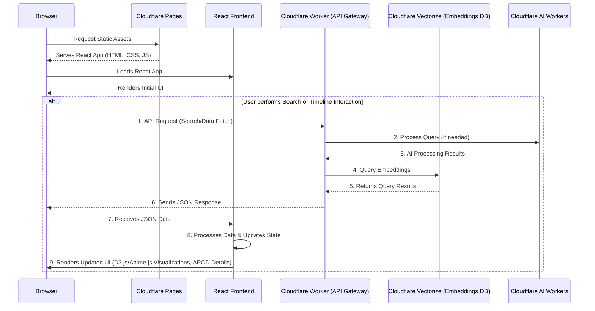

# NASA APOD Viewer

> A simple web application to browse NASA's Astronomy Picture of the Day (APOD) archive.

## Overview

This project is a web application that allows users to view and explore images from NASA's Astronomy Picture of the Day (APOD) archive. It is built with React and uses a Cloudflare Worker to fetch data from the NASA APOD API.

## Features
- **Semantic Search**: Vector-based search across APOD descriptions and generated image captions
- **Interactive Timeline**: Visual exploration of APOD data with D3.js-powered visualizations
- **Real-time Processing**: Live AI inference using Cloudflare's edge computing platform
-   Browse NASA's APOD archive by date.
-   View high-resolution images and detailed explanations for each picture.
-   Responsive design for both desktop and mobile devices.

## :building_blocks: Architecture

### System Overview

The application follows a modern serverless architecture leveraging Cloudflare's edge platform:

- **Frontend**: React SPA hosted on Cloudflare Pages
- **API Layer**: Cloudflare Workers for serverless compute
- **Vector Database**: Cloudflare Vectorize for semantic search
- **AI Models**: Cloudflare AI Workers for image and text processing
- **Storage**: Cloudflare R2 for image assets

### Data Flow



## :robot: AI Models & Processing Pipeline

The system leverages multiple specialized AI models from Cloudflare's catalog:

| Model | Purpose | Use Case |
|-------|---------|----------|
| `@cf/llava-hf/llava-1.5-7b-hf` | **Vision-Language** | Generate descriptive captions from astronomical images |
| `@cf/baai/bge-base-en-v1.5` | **Text Embedding** | Create semantic vectors for search and similarity matching |
| `@cf/huggingface/distilbert-sst-2-int8` | **Text Classification** | Categorize APOD content by astronomical phenomena |
| `@cf/facebook/detr-resnet-50` | **Object Detection** | Identify celestial objects and structures in images |
| `@cf/microsoft/resnet-50` | **Image Classification** | Classify image types and astronomical categories |

### Processing Workflow

1. **Data Ingestion**: Fetch APOD data from NASA's API
2. **Image Analysis**: Generate captions and detect objects using vision models
3. **Text Processing**: Create embeddings and classify content
4. **Vector Storage**: Store embeddings in Cloudflare Vectorize
5. **Search & Discovery**: Enable semantic search and content recommendations


## Project Structure

```
nasa-apod-search/
├── public/               # Static assets
├── src/
│   ├── react-app/        # React frontend application
│   └── worker/           # Cloudflare Worker backend
├── package.json
├── vite.config.ts
└── wrangler.toml
```

## :link: Links

- [NASA APOD API](https://api.nasa.gov/)
- [Live Demo](https://nasa-apod-search.darleison-rodrigues.workers.dev)
## :star: Acknowledgments

- NASA for providing the incredible APOD dataset
- Cloudflare for their edge AI platform
- The open-source community for the underlying ML models

---

**Built with :heart: for space exploration and AI innovation**
